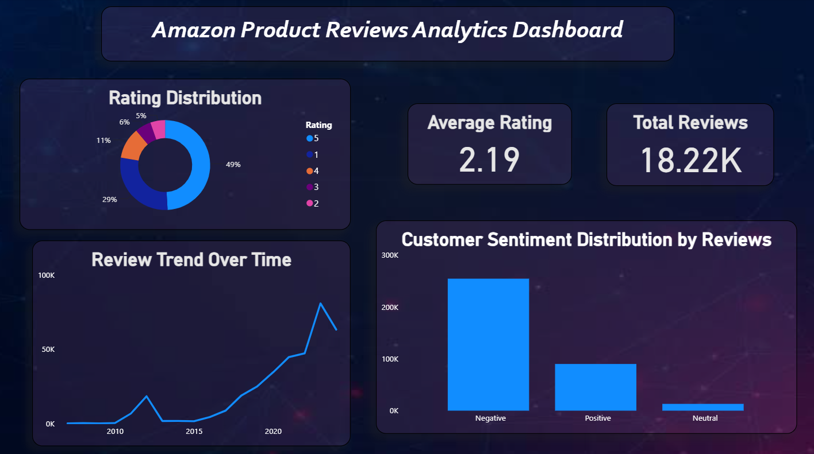

# 🛒 Amazon Product Reviews Analytics

## 📌 What is this project about?
I built this project to analyze over 42,000+ Amazon product reviews. The main goal is to look at raw customer feedback, understand if they are happy or unhappy using Sentiment Analysis, and find out exactly where the products need improvement.

---

## 🏗️ Extended Description (How I Built This Project)
To complete this project, I created a simple data pipeline that takes messy, raw text and turns it into clean charts. Here is exactly how I worked on it step-by-step:

### 1. Understanding the Data with SQL
Before doing any charting or coding, I loaded the raw Amazon review dataset into the database. I used SQL queries to check the data quality—like finding missing values, checking total review counts, and cleaning up formatting errors. This gave me a clear picture of what the data looked like.

### 2. Processing Text & Sentiment Analysis with Python
Raw customer comments are very messy. I used Python (Pandas and TextBlob/NLTK) to clean the text. 
* I removed unwanted characters, symbols, and common words (stop-words) that don't add value.
* Then, I ran a Sentiment Analysis model on the cleaned text. This model automatically read each review and gave it a score (Positive, Negative, or Neutral) based on the words the customer used.

### 3. Creating the Dashboard in Power BI
Once I had the clean data and sentiment scores from Python, I imported the final dataset into Power BI. I connected the tables properly and wrote custom DAX formulas to calculate dynamic metrics (like average ratings and sentiment percentages). Finally, I designed the layout to make it look clean and easy for anyone to understand.

---

## 💾 Project Datasets
*Note: Since the dataset files are very large, GitHub cannot display them directly in the browser. You can click the links below to download them directly from this repository:*

* 📁 [Download Original Raw Dataset](https://github.com/JitendraAmbekar/Amazon_review_analysis/blob/main/तुझ्या_पहिल्या_डेटा_फाईलचे_नाव.csv)
* 📁 [Download Cleaned Sentiment Dataset](https://github.com/JitendraAmbekar/Amazon_review_analysis/blob/main/तुझ्या_दुसऱ्या_डेटा_फाईलचे_नाव.csv)

---

## 💼 The Problem I Solved
In online shopping, if products get bad reviews and low ratings, sales go down immediately. I noticed that many products have issues, but it's hard to read thousands of text reviews manually. 

This project solves that by:
* Finding out the exact reasons behind low ratings.
* Cleaning up messy customer comments to see what they really think.
* Giving clear suggestions to the team so they can fix product quality.

---

## 📊 Dashboard Preview
 

---

## 🛠️ Tools I Used
* **Power BI:** For building the interactive dashboard and writing DAX formulas.
* **Python:** For text cleaning and running the Sentiment Analysis model.
* **SQL:** For exploring the dataset and filtering the data.

---

## 💡 Key Insights I Found
* **Low Average Rating:** The overall rating is just **2.19 out of 5**. This is a big warning sign that many products have serious quality issues.
* **Negative Feedback Dominates:** The sentiment breakdown clearly shows that negative reviews are much higher than positive ones.
* **Trends Over Time:** I tracked the review numbers across different years to see exactly when the product quality started dropping.

---

## 🎯 How this helps the Business
Based on my dashboard, a company can take these quick actions:
1. **Fix Bad Products First:** Stop selling or improve the items that are stuck in the lowest rating bracket.
2. **Improve Marketing:** Use the good words from positive reviews in advertising, and fix the common complaints in the FAQ section.
3. **Help Angry Customers:** The support team can easily find customers with highly negative scores and solve their issues to save the brand's reputation.

---

## 🏁 Conclusion
This project successfully takes thousands of messy, unorganized customer comments and turns them into clean, visual insights. Even though the current average rating (**2.19**) is low, this Power BI dashboard gives management a clear roadmap on what to fix first to improve quality and grow sales.

---

## 🚀 How to check it out
1. Download or clone this repository.
2. Open the `.pbix` file using **Power BI Desktop** to interact with the dashboard.
